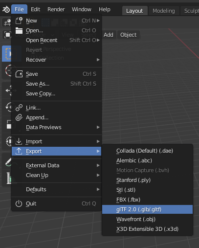

=================
Making Your Scene
=================
For this game, we're simply going to start out with a base and a player.
The base can be any platform you see fit to make in Blender-just watch the physics impostor type when importing the platform-but for this step-by-step guide
we'll only need to make a rectangular prism for the base.
Again, to do this, we're going to need Blender. You can find it at https://blender.org/download, or on Debian systems, install it with the command:

.. code-block:: bash

    sudo apt install blender

Note that you are running Debian (or a Debian-based system), so you won't have the latest version of Blender by installing it this way.

Start by launching Blender. You'll notice a cube, a camera, and a light. You'll need to remove the camera and the light by clicking on them and pressing the delete key.

Now, I strongly recommend that you familiarize yourself with Blender if you haven't already. From this point on, I'll assume that you have some basic knowledge of Blender.

Once you have the scene with just a cube, you're going to have to resize it. Note that Blender uses the Z-axis to point upwards, so we want to scale the object to something like the ordered pair (20, 20, .5)

.. image:: platform.png

If you are advanced enough, you can change the material of your object or apply textures to it using something called nodes.

Because this is aimed at being a simple starting game, you're done! You need to export your scene now, and the best way to do that is to export it to a glTF.
You're going to have to head to File > Export > glTF 2.0 and export your file to your game folder. Specifically, you'll want to put it in the subdirectory "models"
in your game folder, and name the file "base.glb".

Great work! You just made and exported your scene on top of setting up your environment. We're going to do something similar for the player,
and then in further steps, we're going to import both this base and the player.